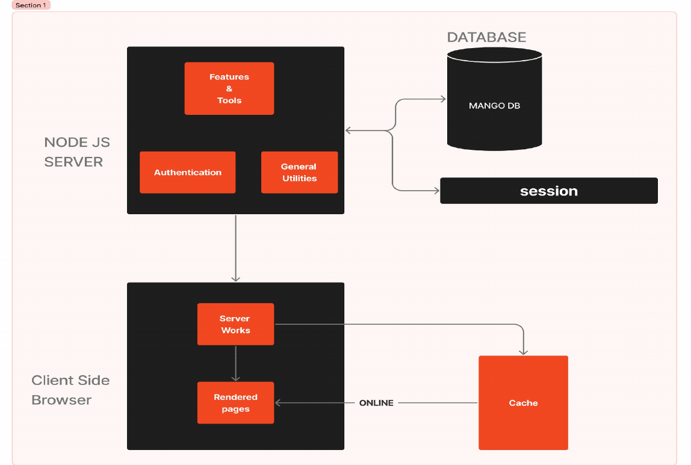

# Project V Web App Architecture

The architecture diagram above provides an overview of the Project V web app's functioning. The core concept involves caching essential online resources on the client side, optimizing user experience and minimizing data usage. Let's delve into the key components:

## Service Worker Logic (sw.js)

The logic implemented in the service worker (`sw.js`) plays a pivotal role in caching online resources locally on the client side. This caching mechanism not only enhances the app's responsiveness but also enables offline usage. Users can revisit the app without incurring substantial data costs, as the necessary resources are readily available from the local cache.

## Manifest.json Integration

The `manifest.json` file complements the caching strategy by enhancing user interaction. It allows users to install the Project V web app on their home screens, providing a seamless and convenient experience. The manifest file configures the app's appearance and behavior, contributing to an intuitive and user-friendly interface.

## Content Delivery Network (CDN) Optimization

To optimize operational costs and enhance data transfer efficiency, Project V leverages a Content Delivery Network. Bulky files, such as WebAssembly (wasm), are strategically placed in the CDN (specifically jsDelivr). This not only reduces bandwidth costs during operations but also accelerates data transfer, ensuring a swift and responsive user experience.

## Development Environment Optimization

During the development phase, specific files from the public repository [Project-V-Public](https://github.com/ProjectV103/Project-V-Public) are utilized to minimize bandwidth costs. By changing the `env_mode` during development, the app intelligently adapts to use these files, streamlining the development process and reducing resource consumption.

By adopting this architecture, Project V achieves a harmonious balance between operational efficiency, user experience, and development optimization. The strategic use of caching, manifest integration, CDN placement, and development environment considerations collectively contribute to a robust and resource-efficient web application.
